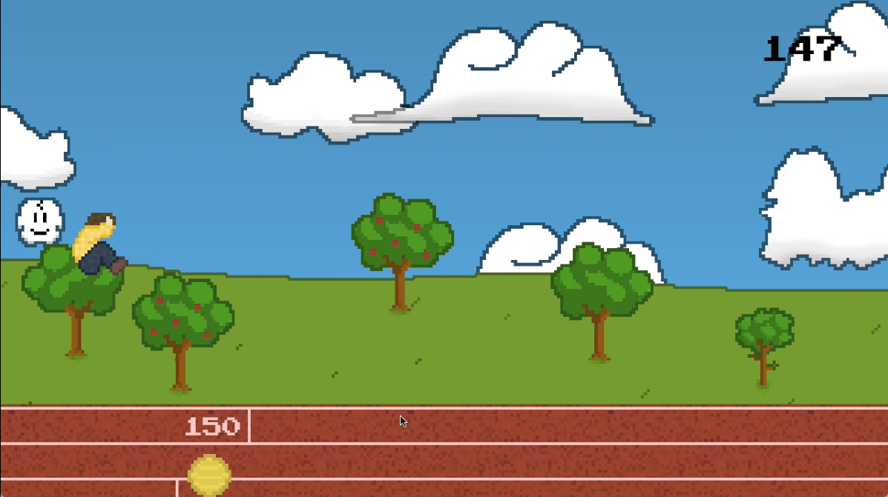
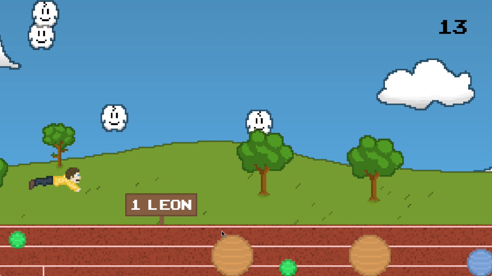

# ballsurf

A game created at [GameJam 2019, TU Dresden](https://imld.de/gamejam/).

## Inspiration
This game was inspired by a YouTube video of Nicholas Smith setting the Guinness World Record for Swiss ball surfing.

[](https://www.youtube.com/watch?v=Bf7v4J6RaIo)

## Screenshots




## Usage

### With Poetry
```bash
poetry install
poetry run python src/ballsurf.py
```

### Without Poetry
```bash
pip3 install -r requirements.txt
python3 src/ballsurf.py
```
